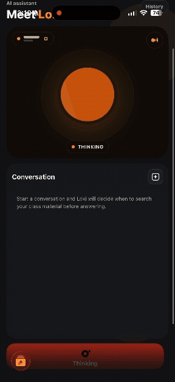
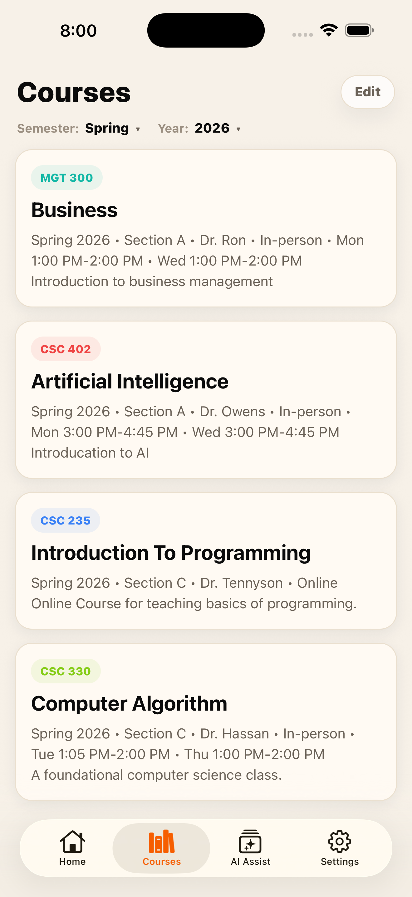
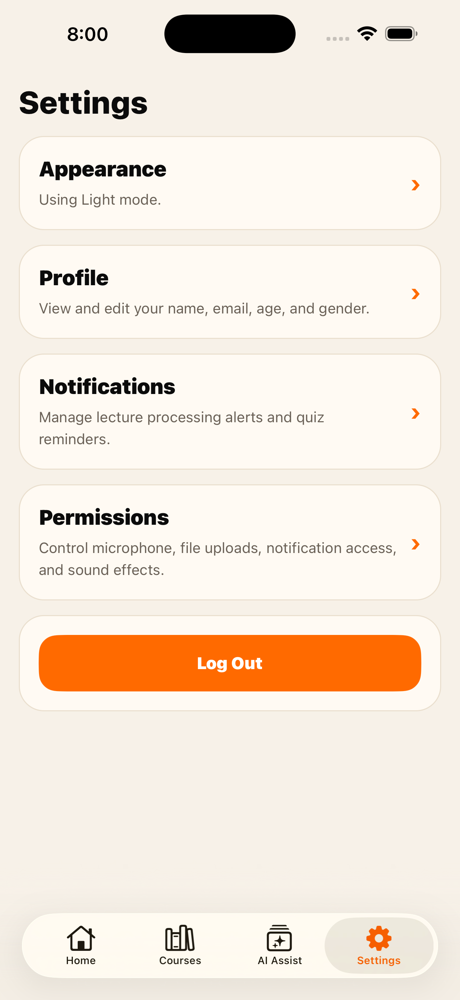

<p style="text-align: center; font-size: 2.5em; font-weight: bold; margin-top: 0.5em;">
  LectrAI
</p>
<p align="center">
  
</p>


<p style="text-align: center">
  AI-powered lecture capture, transcription, and study generation.
</p>

<p style="text-align: center">
  Record lectures, organize material, and turn raw audio into summaries, concepts, quizzes, flashcards, and searchable study context.
</p>

---

## Preview

### Demo




### App Screenshots

<p align="center">
  
  
  
  
</p>

<!-- Swap these image paths whenever you add better screenshots. -->
<!-- Suggested asset folder for future README media: docs/readme-assets/ -->

## What It Is

LectrAI is an AI-assisted lecture capture and study platform built for students who want more than a raw recording. The app is designed to help users record lectures, upload audio, generate structured study materials, and ask questions against their own lecture content.

This repository is an Nx monorepo containing the mobile app, backend API, shared packages, and infrastructure for the platform.

## Core Features

- Lecture recording and capture workflows in the mobile app
- Audio upload to a cloud-backed backend
- AI-generated transcripts, summaries, key concepts, and timelines
- Study tooling such as quizzes and flashcards
- Retrieval-based chat grounded in a student's own lecture material
- Shared packages and infrastructure managed from one workspace

## Monorepo Structure

```text
apps/
  mobile   Expo app for capture and study workflows
  api      Node API for backend services

packages/
  db            Database and Supabase helpers
  shared-types  Shared TypeScript types
  shared-utils  Shared utility helpers

infra/
  terraform     Infrastructure modules and environments

tools/
  scripts       Workspace utility scripts
```

## Tech Stack

- `Expo` + `React Native`
- `Nx` monorepo tooling
- `Node.js` backend services
- `Supabase` for backend data and auth-related integrations
- `Terraform` for infrastructure

## Quick Start

### Requirements

- `Node.js` 20.x
- `npm` 10.x

### Install

```bash
npm install
```

### Common Commands

```bash
npm run start
npm run ios
npm run android
npx nx serve api
npx nx run infra:fmt
npx nx run infra:validate
npx nx run infra:plan
```

## Mobile App Setup

The Expo app reads public client-side variables from `apps/mobile/.env.local`.

1. Copy `apps/mobile/.env.example` to `apps/mobile/.env.local`.
2. Set `EXPO_PUBLIC_API_BASE_URL` to your backend URL.

Example for the iOS simulator:

```bash
EXPO_PUBLIC_API_BASE_URL=http://localhost:3000/api
```

Example for a physical device on the same network:

```bash
EXPO_PUBLIC_API_BASE_URL=http://192.168.1.42:3000/api
```

Start the app from the repo root so Expo injects the variables during bundling:

```bash
npm run ios
```

If you change an `EXPO_PUBLIC_*` variable, restart Metro before relaunching the app.

## Suggested README Asset Folder

Store README media in:

```text
docs/readme-assets/
```

Suggested filenames:

- `hero-demo.gif`
- `home-screen.png`
- `lecture-detail.png`
- `chat-screen.png`
- `quiz-screen.png`

## Notes

- Root documentation lives in `docs/`
- Infrastructure documentation lives in `infra/terraform/README.md`
- Package-level docs live alongside each package where needed
